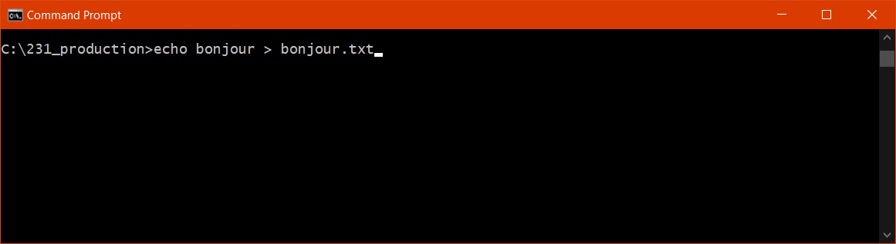
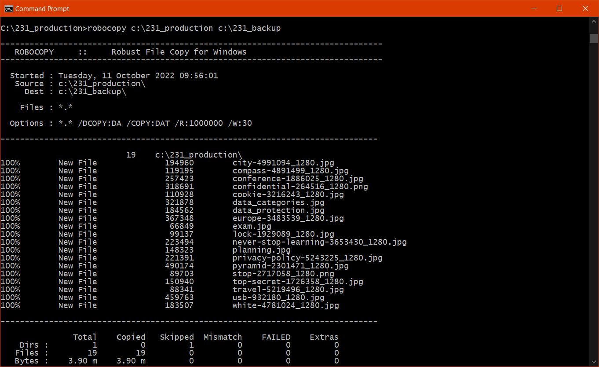
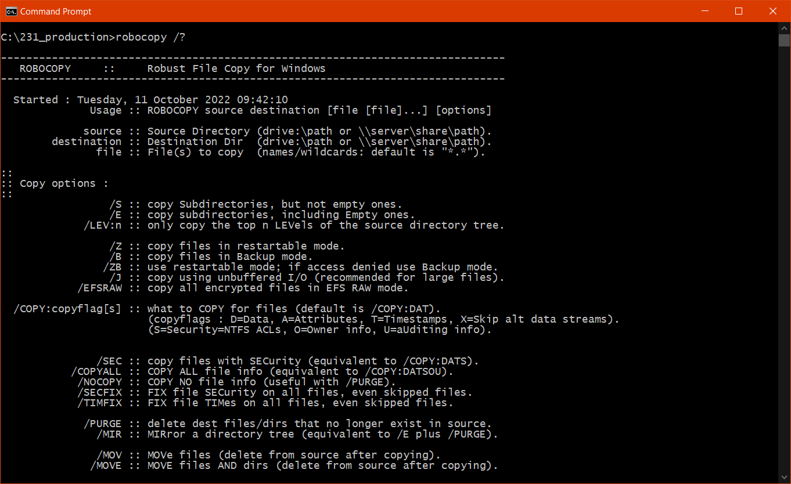

# 💾 E-143-Ex01 - Robocopy

Nom : _______________  
Prénom : _______________   
Date : _______________

---

**📌 Instructions :**
- Complétez cette fiche d'exercices en répondant dans les espaces prévus.
- Testez chaque commande dans votre environnement Windows.
- Entre chaque question, effacez le contenu du dossier de backup avec les commandes suivantes :

```
rmdir "D:\data\backup" /S
mkdir "D:\data\backup"
```

---

## La syntaxe

En tapant `robocopy /?`, vous obtiendrez une page d'aide.

Ainsi on apprend que la syntaxe de robocopy est :

```
ROBOCOPY source destination [file [file]...] [options]
```

Il faut donc toujours commencer par taper le nom de la commande, puis ajouter la **source** (le chemin du répertoire à copier) puis la **destination** (le chemin du répertoire qui contiendra notre copie).

**Que signifie `[` et `]` ?**  
Comme en français, la syntaxe permet d'ajouter des éléments facultatifs.

---

## Questions

### 1. Première copie

Lancez votre première commande robocopy (sans spécifier d'option).



**Quelles sont les options par défaut de robocopy ?**

<textarea rows="5" cols="100"></textarea>

**Que signifie « Files : *.* » ?**

<textarea rows="5" cols="100"></textarea>

---

### 2. Copier uniquement les nouveaux fichiers (exclure les anciens)

Commencez par créer un nouveau fichier `bonjour.txt` contenant le mot *bonjour* à l'aide d'une commande en ligne.



**Saisissez la commande que vous avez utilisée :**

<textarea rows="3" cols="100"></textarea>

---

### 3. Copier tous les fichiers, les répertoires et les sous-répertoires

Vous avez peut-être constaté que seuls les fichiers avaient été copiés, mais que les dossiers et leurs sous-dossiers avaient été ignorés.

**Saisissez la commande qui vous permet de copier les fichiers, les répertoires et leurs sous-répertoires :**

<textarea rows="3" cols="100"></textarea>

---

### 4. Copier tous les fichiers, les répertoires et exclusion d'un répertoire

Parfois, nous souhaitons exclure certains fichiers ou dossiers de la copie automatique. Dans notre cas, nous souhaitons exclure le dossier `D:\data\production\VMs` de la copie.

**Quelle est la commande à utiliser ?**

<textarea rows="3" cols="100"></textarea>

---

### 5. Journalisation

Lorsqu'une tâche automatique est exécutée, il est important d'obtenir un compte rendu des opérations effectuées afin que l'administrateur système puisse prendre les mesures correctives adéquates.

Reprenez votre commande du point 4 et activez l'option de journalisation (log). Le fichier de log doit s'appeler `log_backup_dateactuelle`.

**Saisissez votre commande complète :**

<textarea rows="3" cols="100"></textarea>

---

### 6. Miroir

Dans certains cas, il est important que les fichiers qui n'existent plus dans la source, mais qui existent encore dans la destination, soient effacés de la destination.

À partir de ce point, nous souhaitons que le backup soit **identique** à la source.

**Quelle commande avez-vous effectuée ?**

<textarea rows="3" cols="100"></textarea>

---

### 7. Réflexion : Respect de la règle 3-2-1



**Selon vous, est-ce que votre backup respecte les principes « 3-2-1 » ? Expliquez votre réponse et proposez des améliorations.**

<textarea rows="10" cols="100"></textarea>
