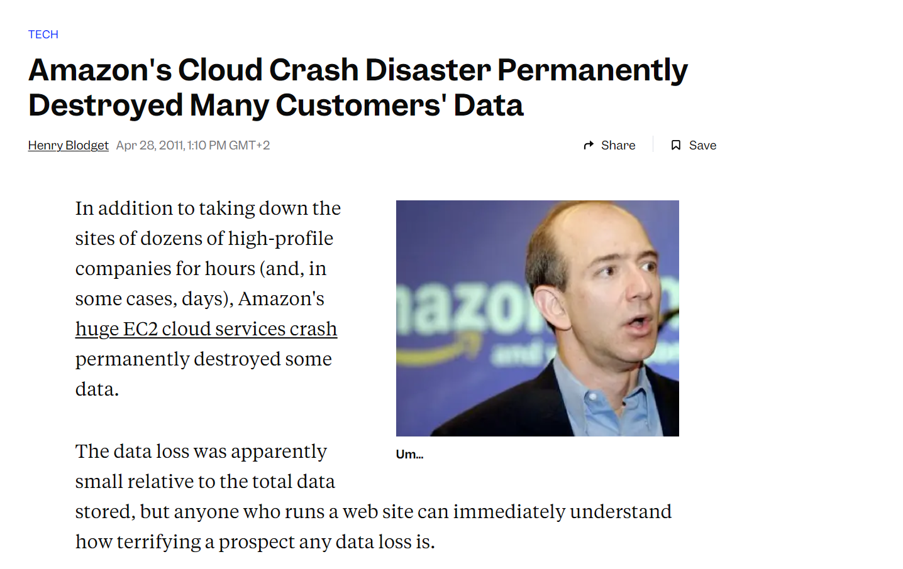
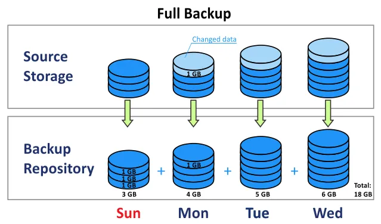
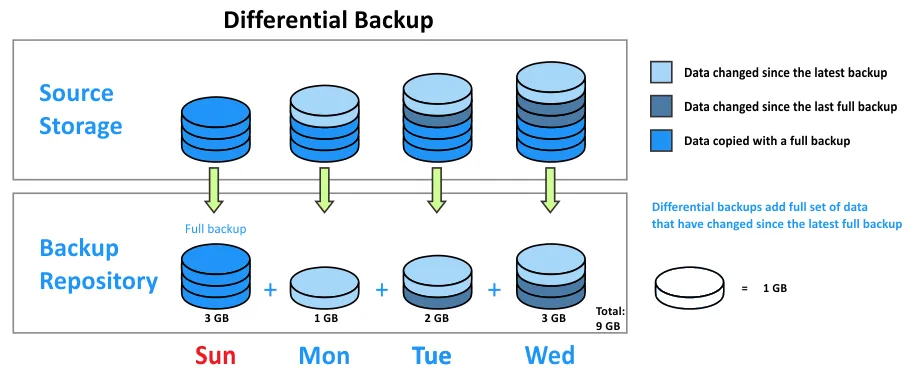
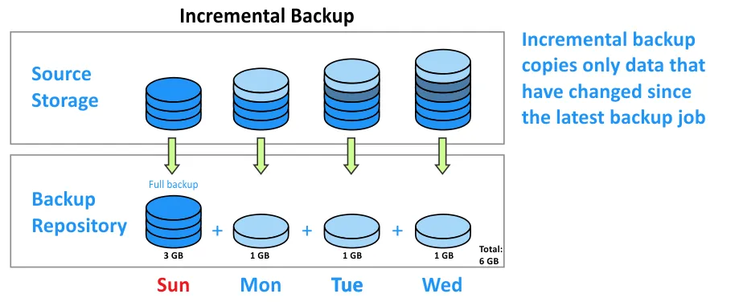
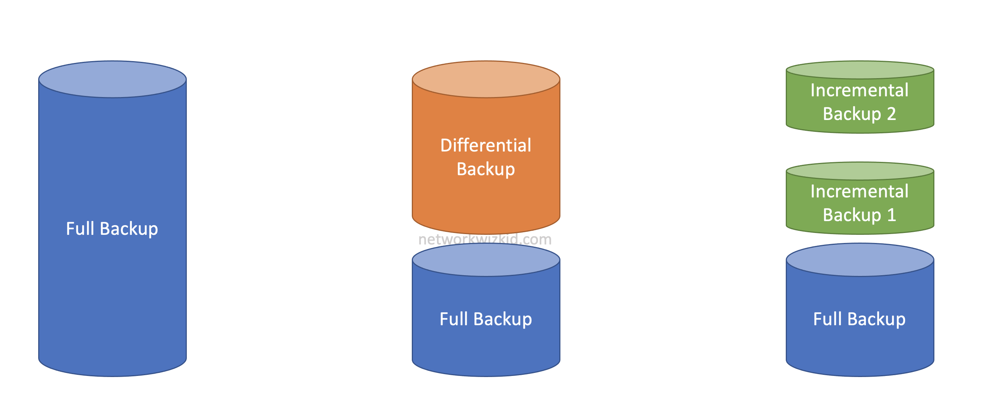
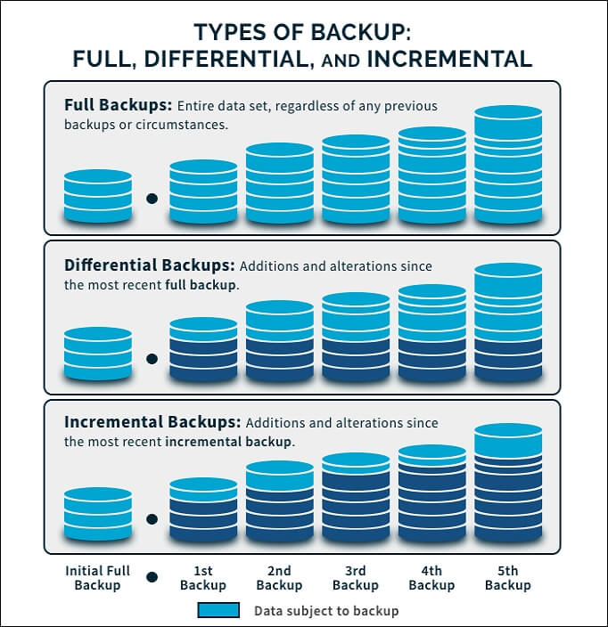
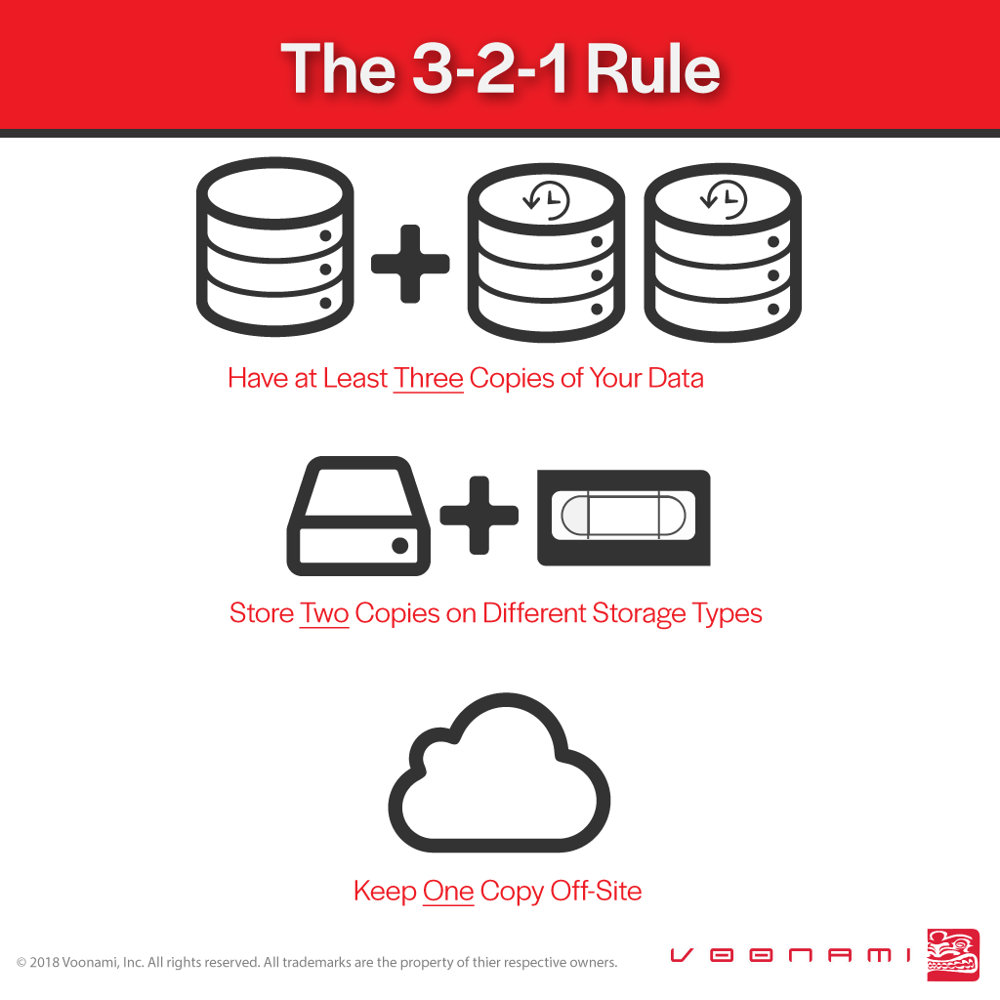

<!-- header: "I143 - Implanter un système de sauvegarde et de restauration" -->
# I143 - Introduction aux concepts de sauvegarde

---

# 143

- Implanter un système de sauvegarde et de restauration

---

# Implanter un système de sauvegarde et de restauration

- Compétence
Etablir des concepts de protection des données, expérimenter et mettre à disposition en respectant les conditions cadres prescrites.

---

# Objectifs opérationnels

- Etablir un concept de sécurité selon les conditions cadres et les directives techniques (p. ex. volumes de données, délais de conservation, dispositions juridiques, intervalles de sécurité, sécurité de conservation, restauration, disponibilité etc.).
- Vérifier le concept élaboré du point de vue faisabilité et, si nécessaire, adapter le concept.
- Déterminer le besoin en appareils et moyens de protections en se fondant sur le concept.
- Etablir les procédures de protection, expérimenter, intégrer dans la conduite des opérations productives et documenter.

---

# Objectifs opérationnels (suite)

- Exécuter et tester les processus de sécurité et de restauration.
- Mettre à jour les documents d’entretien et d’exploitation. Mettre à disposition les systèmes de sauvegarde et de restauration pour l’exploitation productive.

---

# Fil rouge : Projet P_Backup

- Vous êtes un/e informaticien/ienne dans une société de cybersécurité Suisse nommée « PWNED » en pleine expansion. Votre PME a un volume de données croissant (actuellement 5 To, avec une croissance stable de 1To/an). PWNED se doit de respecter des exigences légales strictes (RGPD, LPD/nLPD,  confidentialité) car elle a différents mandats confidentiels, notamment pour la FEDPOL et l’Armée Suisse.
- Votre supérieur vous demande de mettre en place un DRP et dans ce cadre d’élaborer et mettre en place un système complet de sauvegarde et récupération.
- La direction souhaite un système de sauvegarde robuste, sécurisé, et conforme aux standards modernes. Vous devrez concevoir, tester, et déployer ce système, tout en documentant les processus pour garantir leur maintenance et évolutivité.

---

# Introduction aux concepts de sauvegarde

- Semaine 1

---

# Agenda – Semaine 1

- Pourquoi la sauvegarde est essentielle : Les enjeux
  - Cas concrets d’incidents (perte de données, ransomware).
  - Conséquences financières et opérationnelles.
- Les types de sauvegarde
  - Complète, différentielle, incrémentale (illustrations avec scénarios simples).
  - Points forts et faibles.
  - Différence avec l’archivage
- Présentation de la méthode 3-2-1
  - 3 copies de données, 2 supports différents, 1 hors site.
  - Liens avec la sauvegarde cloud et hors site.
- P-BACKUP : Découvrir des solutions de base (Robocopy (Windows), Shadow Copy)

---

# Pourquoi la sauvegarde est essentielle : Les enjeux

- Une sauvegarde, c’est quoi ?
- Une copie des données stockées dans un lieu sûr.
- Une sauvegarde consiste à créer des copies de données afin de les protéger contre des pertes accidentelles ou malveillantes.
- Elle garantit la continuité des opérations et le respect des obligations légales.

---

# Quelques cas concrets d’incidents

- Ransomware
- WannaCry : En 2017 a paralysé des hôpitaux et entreprises en cryptant leurs données.
- Petya
- Merci à la NSA pour EternalBlue 🫤
- Conséquence : Les entreprises sans sauvegarde ont dû payer ou perdre définitivement leurs données. Dans certains cas il a été possible de récupérer les données.
- IL NE FAUT JAMAIS PAYER. Cela encourage le crime organisé.

---

# WannaCry Ransomware Attack
video : https://www.youtube.com/watch?v=PKHH_gvJ_hA

<iframe width="560" height="315" src="https://www.youtube.com/embed/PKHH_gvJ_hA?si=ulOhPlsHzOd6xTHe" title="YouTube video player" frameborder="0" allow="accelerometer; autoplay; clipboard-write; encrypted-media; gyroscope; picture-in-picture; web-share" referrerpolicy="strict-origin-when-cross-origin" allowfullscreen></iframe>

---

# Quelques cas concrets d’incidents

- Panne matériel
- Exemple : Crash de disque dur ou RAID défectueux
- Conséquence : Données perdues si aucune sauvegarde disponible.
- Erreur humaine
- Exemple : Suppression accidentelle d’un fichier ou base de données par un employé.
- Conséquence : Temps de récupération prolongé sans sauvegarde récente ou impossible si pas de sauvegarde.

---

# Exemples - Public Cloud

  

---

# Quelques cas concrets d’incidents

- Catastrophe naturelle
- Exemple : Inondation ou incendie dans un data center.
- Conséquence : Destruction physique des supports de données.

---

# Conséquences financières et opérationnelles

- Financières
  - Perte de revenus (temps d’arrêt prolongé).
  - Amendes liées à la non-conformité légale (exemple : RGPD).
  - Coût de la reconstruction des données.
- Opérationnelles
  - Temps d’arrêt des services critiques.
  - Perte de confiance des clients/partenaires.
  - Difficultés à respecter les engagements contractuels.

---

# Les types de sauvegardes

- Sauvegarde complète :
- Description : Copie intégrale de toutes les données.
- Points forts : Facilité de restauration rapide, toutes les données sont regroupées en un seul endroit.
- Points faibles : Temps long à réaliser, nécessite beaucoup d’espace de stockage.
- Exemple : Effectuée chaque dimanche soir, prend 6 heures et 1 To d’espace.

---

# Full Backup

---

# Les types de sauvegardes

- Sauvegarde différentielle :
- Description : Copie uniquement des données modifiées depuis la dernière sauvegarde complète.
- Points forts : Plus rapide qu’une sauvegarde complète, consomme moins d’espace.
- Points faibles : Restauration plus lente (nécessite la sauvegarde complète + la sauvegarde différentielle).
- Exemple : Effectuée tous les soirs de semaine après la sauvegarde complète du dimanche.

---

# Differential Backup

---

# Les types de sauvegardes

- Sauvegarde incrémentale :
- Description : Copie uniquement des données modifiées depuis la dernière sauvegarde (complète ou incrémentale).
- Points forts : Très rapide, espace disque minimal.
- Points faibles : Restauration plus complexe (chaîne de dépendance avec les sauvegardes précédentes).
- Exemple : Sauvegarde réalisée toutes les 2 heures pour capturer les modifications fréquentes.

---

# Incremental Backup

---

# Les types de sauvegardes

---

# Les types de sauvegardes

- Souvent on a des politiques de sauvegardes qui vont mixer plusieurs types.

---

# Les types de sauvegardes

---

# Différence avec l’archivage

- Sauvegarde :
- Objectif : Protection à court terme pour récupération rapide en cas de perte.
- Conservation : Généralement limitée dans le temps (cycles hebdomadaires ou mensuels avec généralement un backup annuel et une conservation de ces backups sur une certaine durée. P.ex 12 backups mensuels, 5 annuels, etc.)
- Archivage :
- Objectif : Conservation des données à long terme pour des besoins légaux ou historiques.
- Conservation : Longue durée, parfois permanente.
- Exemple : Archivage des données comptables pour 10 ans selon les normes légales.

---

# Qu’est-ce que la méthode 3-2-1 ?

- Pourquoi cette méthode est-elle essentielle ?
- Réduit les risques de perte de données liée à :
- Défaillance matérielle : Copie sur un support différent.
- Catastrophes locales : Sauvegarde hors site.
- Ransomware : Isolement des données sensibles.

---

## P_Backup – COMMENCER Partie 1 :

Mettre en place un serveur de fichier avec ou sans DFS

Mettre en place Shadow Copy

Créer un script Robocopy avec une tâche planifiée qui copie (mirror) le contenu du share sur le serveur BCKP

---

## ASTUCES
P_Backup - Partie 1 :

- Désactiver FireWall 
- Utiliser un Disque dédié au fileshare , p.ex un disque D
