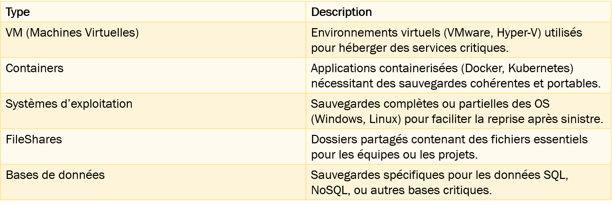
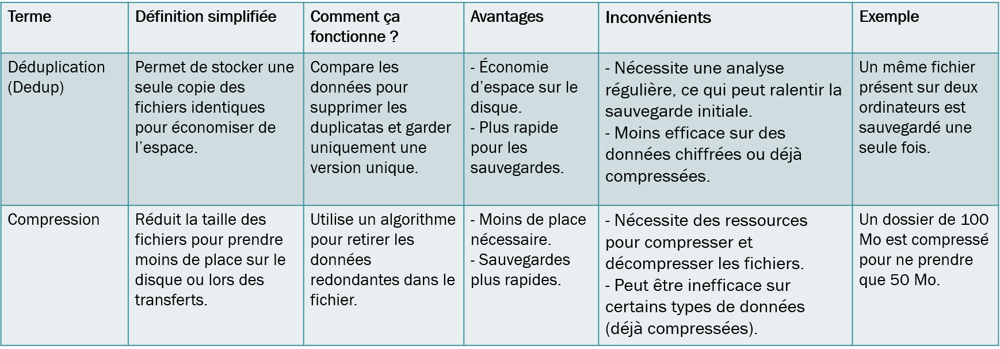
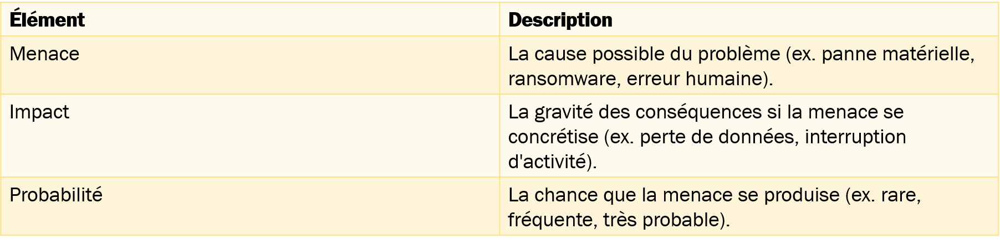
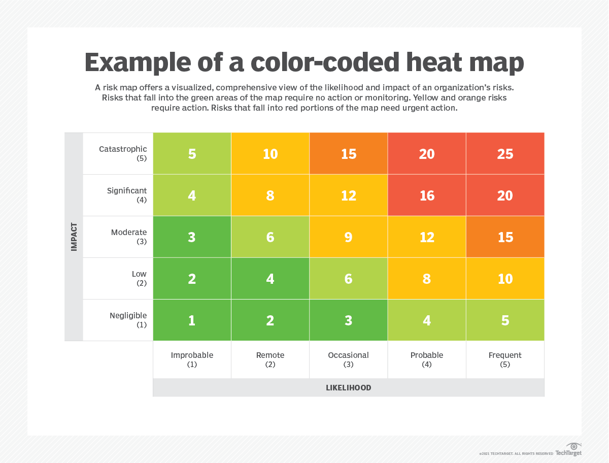

<!-- header: "I143 - Implanter un système de sauvegarde et de restauration" -->
# I143 - Analyse des besoins et conditions cadres

---

# Analyse des besoins et conditions cadres

- Semaine 2

---

# Agenda – Semaine 2

- Analyse des besoins
  - Qu’est-ce que l’on sauvegarde ?
  - Volumétrie des données
  - Rétention des données
- Conditions cadres
  - Législation (RGPD, LPD / nLPD, exigences locales)
  - Le «Cloud Act»
  - Contraintes techniques (bande passante, infrastructure réseau).

---

# Agenda – Semaine 2 (suite)

- Évaluer les risques
  - Techniques (pannes matérielles), organisationnels (erreurs humaines), personnels (vol de données).
  - Utilisation d’une Heat Map
- P-BACKUP : Analyser les besoins, les contraintes légales et les risques  pour PWNED

---

# Analyse des besoins pour une solution de backup/restore

- Pourquoi analyser les besoins ?
- Objectif : Identifier les spécificités techniques, légales et organisationnelles nécessaires pour concevoir une solution de sauvegarde adaptée.
- Résultat attendu : Une solution qui répond aux attentes en matière de protection, conformité et performance.

---

# Qu’est-ce que l’on sauvegarde ?

- Pourquoi définir ce que l’on sauvegarde ?
- La première étape dans la mise en place d’une solution de sauvegarde est de lister précisément les éléments à protéger.
- Cela permet d’adapter les outils, les méthodes et les stratégies en fonction des besoins spécifiques.

---

# Types d’éléments à sauvegarder (exemple)

---

# Identifier les éléments essentiels / la criticté

- Quels sont les éléments essentiels à l’entreprise ?
  - P.ex : Une base de données clients
  - P.ex : Un serveur de fichiers
- A quelle fréquence devons nous les sauvegarder ?
  - P.ex : La base de données clients => Chaque 2h
  - P.ex : Le serveur de fichier 1x par jour + 1 fois par semaine un full
- Quel type de sauvegarde ?
  - Complète (full) , Incrémentale , Différentielle ?

---

# Volumétrie des données

- Qu’est-ce que la volumétrie ?
- Estimation de la quantité totale de données à sauvegarder.
- Prise en compte de la croissance des données dans le temps.

---

# Volumétrie des données

- Facteurs à considérer :
- Données actuelles :
  - Exemple avec PWNED – 5 To aujourd’hui, augmentation estimée à +1To/an
- Nature des données :
  - Fichiers vidéos / images
  - Fichiers textes
- Fréquence des sauvegardes :
  - Quotidienne, hebdomadaire, mensuelle
  - Tout cela va influencer le choix de l’infrastructure et des outils (Espace disque, bande passante, etc)

---

# Rétention des données

- Qu’est-ce que la rétention ?
- Durée pendant laquelle les sauvegardes doivent être conservées avant d’être supprimées.
- Types de rétention à définir :
- Court terme :
  - Sauvegarde quotidienne ou hebdomadaires pour restauration rapides.
- Long terme :
  - Sauvegarde mensuelles ou annuelles selon les conditions cadres (politique de sauvegarde, raisons légales, etc)

---

# Qu'est-ce que les conditions cadres ?

- Définition :
Les conditions cadres représentent l'ensemble des contraintes, obligations et spécificités qui doivent être prises en compte lors de la conception et de l'implémentation d'un système de sauvegarde et de restauration.
- Conformité légale : Garantir que le système respecte les lois et régulations applicables (RGPD, LPD/nLPD, etc.).
- Sécurité des données : Assurer que les données sensibles sont protégées contre les menaces internes et externes.
- Adéquation technique : Veiller à ce que l'infrastructure réseau et les outils choisis soient adaptés aux besoins actuels et futurs de l'organisation.
- Réglementation et politique interne / de l’entreprise .

---

# RGPD (Règlement Général sur la Protection des Données)

- Législation européenne adoptée en mai 2018.
- S’applique à toutes les entreprises traitant des données personnelles de citoyens européens, peu importe leur localisation.
- Toute entreprise suisse manipulant des données de citoyens européens doit se conformer à la RGPD.
- Risque de sanctions en cas de non-conformité (amendes jusqu’à 20 M€ ou 4 % du CA mondial).

---

# RGPD : Points importants

- Principes de traitement des données
  - Minimisation des données.
  - Exactitude et conservation limitée.
- Sécurité des traitements
  - Obligation d'assurer la sécurité des données (p.ex. Chiffrement, accès restreint).
- Droit à l’oubli
  - Les individus peuvent demander la suppression de leurs données sous certaines conditions.
- Notification de violation de données
  - Obligation de notifier toute fuite de données à l’autorité compétente.

---

# LPD / nLPD (Loi fédérale sur la Protection des Données)

- nLPD : Législation suisse entrée en vigueur en septembre 2023.
- Inspirée de la RGPD mais adaptée au contexte suisse.

---

# LPD : Points importants à retenir

- Droit d'accès
  - Les individus peuvent demander quelles données sont collectées et à quelles fins.
- Sécurité des données
  - Obligation de garantir la confidentialité, l’intégrité et la disponibilité des données.
  - Mesures techniques et organisationnelles adaptées aux risques.
- Obligation de notification
  - En cas de violation de données, informer rapidement les personnes concernées et, si nécessaire, le Préposé fédéral à la protection des données (PFPDT) ainsi que les personnes concernées.

---

# Le“Cloud Act” Américain

- Clarifying Lawful Overseas Use of Data Act
- Législation américaine adoptée en 2018
- Permet aux autorités américaines d'accéder aux données stockées par des entreprises américaines, même si les serveurs sont situés hors des États-Unis.
- Impact pour les entreprises suisses :
  - Risque pour la confidentialité.
  - Non-conformité potentielle avec les lois en vigueurs. (LPD/RGPD)

---

## Contraintes techniques liées à la sauvegarde / restauration

- Bande passante
- Problème :
  - Les sauvegardes régulières, en particulier hors site (cloud), nécessitent une bande passante élevée, surtout pour les grandes quantités de données.
- Solution :
  - Planification des sauvegardes pendant les heures creuses
  - Compression des données pour réduire la taille des transferts

---

# En parlant de compression…

- Souvent les technologies de backup embarquent des systèmes de compression mais également des systèmes de deduplication.
- Mais, c’est quoi ?

---

# Dedup & Compression

---

## Contraintes techniques liées à la sauvegarde / restauration

- Infrastructure réseau
- Problème :
  - Les interruptions ou faiblesses du réseau peuvent compromettre les sauvegardes ou les restaurations.
- Solution :
  - Redondance du réseau.
  - Surveillance et optimisation des performances.

---

## Contraintes techniques liées à la sauvegarde / restauration

- Espace de stockage
- Problème :
  - Saturation de l’espace disponible
- Solution :
  - Dedup & Compression
  - Redéfinition de la politique de sauvegarde et de rétention
  - Investissement dans du matériel

---

## Contraintes techniques liées à la sauvegarde / restauration

- Compatibilité des outils
- Problème :
  - Les outils de sauvegardes doivent être compatible avec différents environnements.
    - OS (Linux, Windows)
    - VMs
    - Containers
    - Solutions de stockage
- Solution :
  - Analyse des besoins et choix d’un outil répondant à nos besoins présents et futurs.
  - Tester les outils (POC) avant le choix de la solution.

---

# Qu’est-ce qu’un risque ?

- Définition :
- « Le risque est la possibilité de survenue d'un événement indésirable, la probabilité d’occurrence d'un péril probable ou d'un aléa » Wikipedia
- En d’autres termes, en entreprise, un risque est une situation ou un événement potentiel pouvant nuire à un système/une organisation/un projet.

---

# Pourquoi évaluer les risques ?

- Objectif : Identifier les menaces qui justifient la mise en place d’un système de sauvegarde/restauration et celles qui peuvent impacter son efficacité.
- Dans notre module, le 143, on a deux « types » principaux :
  - Risques expliquant la nécessité d’un système de sauvegarde : Protéger contre la perte ou la corruption des données.
  - Risques liés à un système de backup/restore mal conçu : Éviter les défaillances dans la protection/sauvegarde des données.
- Pourquoi évaluer les risques ?
  - Prioriser les actions : Concentrer les efforts sur les risques critiques
  - Optimiser les ressources : Prévenir les menaces les plus probables ou ayant les impacts les plus graves-

---

# Éléments constituant un risque

---

# “Calcul” d’un risque

- Pour évaluer un risque, on utilise souvent cette formule :
- Risque=Impact×Probabilité
- Impact : Peut être mesuré sur une échelle (faible, moyen, élevé).
- Probabilité : Peut être exprimée en pourcentage ou sur une échelle qualitative (rare, probable, fréquent).
- Très souvent nous allons utiliser une HEAT MAP.

---

# Exemple concret avec une HEAT MAP

---

## P_Backup – FINIR Partie 1 :

Mettre en place un serveur de fichier avec ou sans DFS

Mettre en place Shadow Copy

Créer un script Robocopy avec une tâche planifiée qui copie (mirror) le contenu du share sur le serveur BCKP

---

## P_Backup – COMMENCER Partie 2 : 

Analyser les besoins, les contraintes légales et les risques de PWNED

---

# PWNED – Contexte Général

- Vous travaillez pour PWNED, une PME suisse spécialisée dans la cybersécurité et en pleine croissance. L'entreprise doit gérer un volume de données en constante augmentation (actuellement 5 To, +1 To/an) et répondre à des exigences légales et sécuritaires élevées. Les mandats sensibles de clients comme la FEDPOL et l’Armée Suisse impliquent une gestion rigoureuse et confidentielle des données.
- Mission confiée :
Votre supérieur vous demande de mettre en place un Disaster Recovery Plan (DRP) complet, dont la première étape consiste à concevoir et implémenter un système de sauvegarde et de restauration. Ce système devra être :
- Robuste : Capable de résister à des pannes et des sinistres.
- Sécurisé : Garantissant la confidentialité des données.
- Conforme : Respectant les lois suisses (LPD/nLPD) et européennes (RGPD).

---

# PWNED - Contexte spécifique aux données

- Données volumineuses et diverses :
- Vos données incluent des fichiers opérationnels critiques (images, vidéos, fichiers textes, scripts), des serveurs virtualisés (VM), des bases de données, et des données sensibles.
- Le service comptable a des besoins spécifiques : conservation des factures et données comptables pendant au moins 10 ans conformément à la loi suisse.
- Exigences légales :
- Confidentialité absolue : Les mandats sensibles (FEDPOL, Armée) exigent des sauvegardes sécurisées pour éviter tout accès non autorisé.
- RGPD : Protection des données des citoyens européens (droit d'accès, droit à l’oubli, etc.).

---

# PWNED- Contexte spécifique aux données (suite)

- LPD/nLPD : Conformité avec les lois suisses pour toutes les données personnelles.
- Problèmes actuels :
- Actuellement PWNED n’a pas de système de backup. Les données sont stockées sur un serveur de fichier Windows sur lequel vous avez uniquement mis en place la fonctionnalité « ShadowCopy » .
