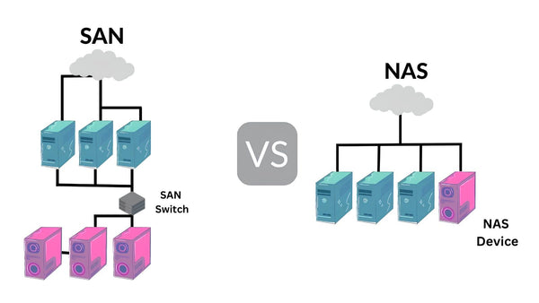
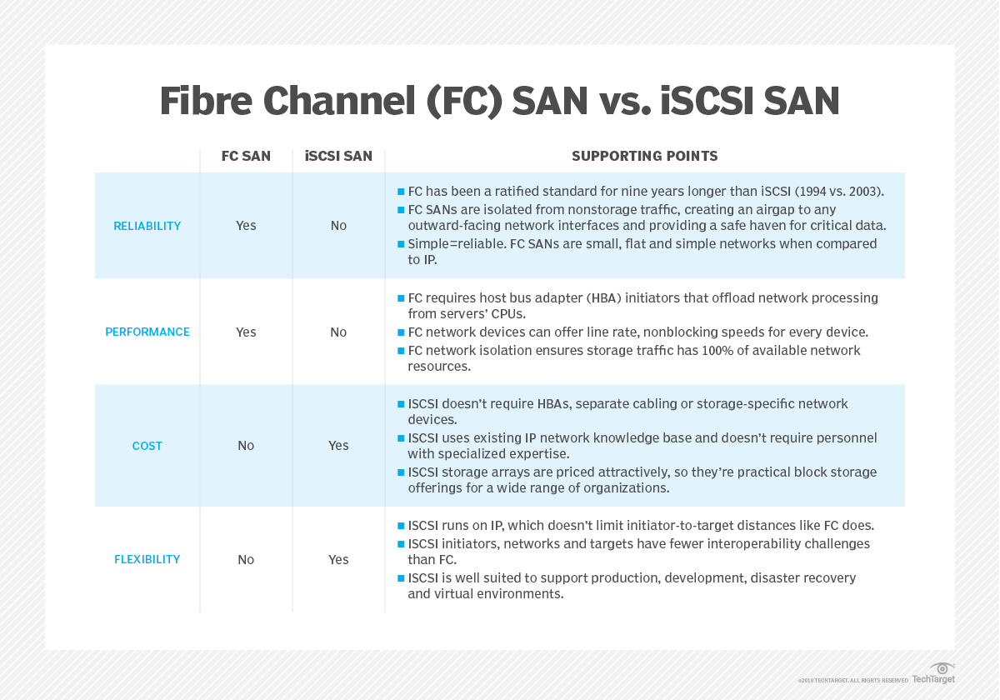
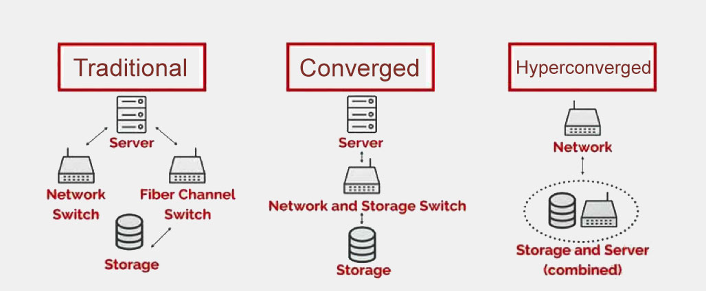
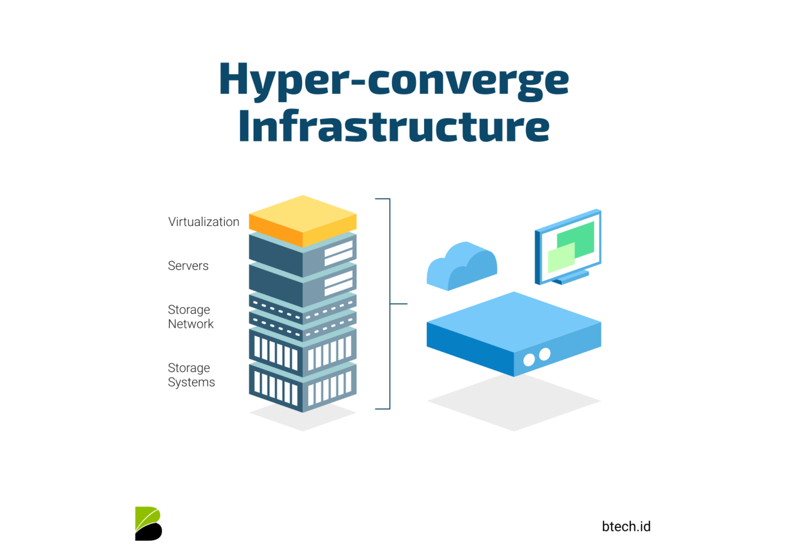
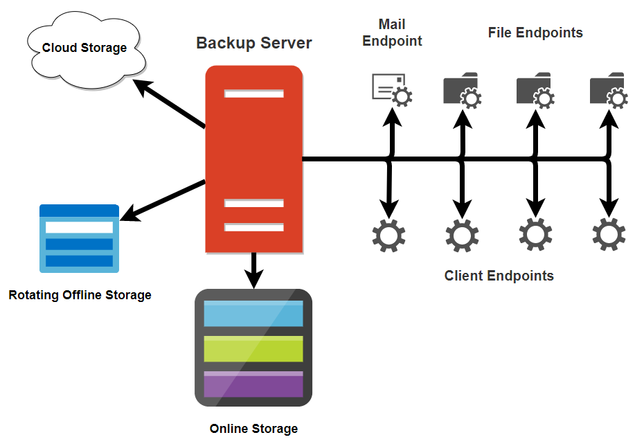

<!-- header: "I143 - Implanter un système de sauvegarde et de restauration" -->
# I143 - Élaboration d'un concept de sauvegarde et restauration

---

## Elaboration d’un concept de sauvegarde et de restauration

- Semaine 3

---

# Agenda – Semaine 3

- Élaboration d’un concept de sauvegarde et restauration
  - Élaboration du concept selon la méthode 3-2-1
  - DRP (Disaster Recovery Plan)
- Conception technique
  - Différences entre SAN, NAS
  - Intérêt des sauvegardes cloud (AWS S3, Google Drive, OneDrive) avec rClone
- Quelques outils
  - Présentation des fonctionnalités de Robocopy et Rsync
  - Présentation de Shadow Copy

---

# Rappel sur les types de sauvegarde

- Sauvegarde complète :
  - Copie entière de toutes les données à un moment donné.
  - Avantages : Simple à restaurer, toutes les données disponibles dans un seul lot.
  - Inconvénients : Temps et espace de stockage élevés.
- Sauvegarde différentielle :
  - Copie des fichiers modifiés depuis la dernière sauvegarde complète.
  - Avantages : Moins d’espace utilisé que la sauvegarde complète.
  - Inconvénients : Temps de restauration plus long.

---

# Rappel sur les types de sauvegarde (suite)

- Sauvegarde incrémentale :
  - Copie des fichiers modifiés depuis la dernière sauvegarde, qu’elle soit complète ou incrémentale.
  - Avantages : Gain de temps et d’espace.
  - Inconvénients : Processus de restauration plus complexe.

---

# Elaboration d’un concept

- Identification des assets et de leur criticité
- Analyse des besoins (volumétrie / rétention)
- Définition/Elaboration de la politique de backup
  - Fréquence
  - Type de sauvegarde
  - Destination
- Tests et validations
  - Méthode 3-2-1 respectée ?
  - Définir les scénarios de tests pour backup / restore
  - Valider la solution

---

# Qu’est-ce qu’un DRP ?

- Définition :
  - Un plan documenté visant à répondre rapidement et efficacement à un incident majeur, tel qu’une panne matérielle, une cyberattaque ou une catastrophe naturelle.
- Objectifs :
  - Réduire les temps d’arrêt.
  - Assurer la continuité des activités.
  - Protéger les données et les actifs critiques.

---

# Les éléments clés d’un DRP

- Identification des actifs critiques :
  - Systèmes, bases de données, fichiers essentiels.
- Scénarios de risque :
  - Pannes matérielles.
  - Cyberattaques.
  - Catastrophes naturelles.
- Stratégies de récupération :
  - Sauvegardes locales
  - Sauvegardes hors site.
- Priorisation :
  - Ordre de restauration basé sur la criticité.

---

## Validation et Maintenance du DRP - Assurer l’efficacité du DRP

- Planification de tests réguliers :
  - Tester les procédures de restauration.
  - Simuler des incidents pour évaluer la réactivité.
- Mise à jour continue :
  - Adapter le DRP en fonction des évolutions technologiques et organisationnelles.
- Documentation :
  - Maintenir une version claire et accessible du plan pour toutes les parties prenantes.
- Suivi des indicateurs (RTO / RPO / MTD / WRT)

---

---

# DRP

- Voir document :

---

# Conception technique : Différences entre NAS / SAN

- NAS (Network Attached Storage)
- SAN (Storage Area Network)
- iSCSI (Internet Small Computer Systems Interface)

---

# NAS (Network Attached Storage)

- Définition : Solution de stockage en réseau accessible via des protocoles tels que SMB, NFS.
- Avantages :
  - Facile à déployer et à configurer.
  - Idéal pour le partage de fichiers et les sauvegardes.
- Inconvénients :
  - Moins performant pour les applications à haute intensité d’E/S ou I/O.
  - Dépend de la bande passante réseau.

---

# SAN (Storage Area Network) - FC

- Définition : Un réseau de stockage dédié qui connecte des serveurs à des ressources de stockage partagées, offrant des performances élevées et une grande évolutivité.
- Réseau dédié en Fibre Optique.
- Avantages :
  - Hautes performances pour les bases de données et applications critiques.
  - Isolé du réseau principal pour une meilleure sécurité.
- Inconvénients :
  - Coût élevé et gestion complexe.
  - Nécessite du matériel spécialisé.

---

# SAN (Storage Area Network) - iSCSI

- Définition : Un réseau de stockage dédié qui connecte des serveurs à des ressources de stockage partagées, offrant des performances élevées et une grande évolutivité.
- Fonctionne sur un réseau IP existant (ethernet) via paquets TCP/IP.
- Avantages :
  - Solution plus économique que FC.
  - Intégration facile dans des infrastructures réseau existantes.
- Inconvénients :
  - Performances limitées par la bande passante du réseau IP.
  - Latence plus élevée que FC.

---

---

---

# Hyperconvergence

---

---

---

# Conception technique : intérêts de la sauvegarde cloud

- Avantages :
  - Accessibilité mondiale : Données accessibles de n'importe où.
  - Protection hors site : Résilience face aux catastrophes locales.
  - Évolutivité : Capacité de stockage ajustable selon les besoins.
  - Sécurité : Chiffrement et redondance intégrée.
  - Pas d'infrastructure à maintenir localement.
- Cas d’utilisation :
  - Reprise après sinistre.
  - Archivage à long terme.
  - Stockage dans une stratégie 3-2-1

---

# rClone : Un outil de sauvegarde cloud

- Qu'est-ce que c'est ?
  - Outil open source en ligne de commande pour synchroniser des fichiers entre local et cloud.
- Avantages :
  - Supporte de nombreux clouds (AWS S3, Google Drive, OneDrive, etc.).
  - Sécurisé (chiffrement des données).
  - Automatisable (intégration avec des scripts).
- Utilisations :
  - Sauvegarde régulière (stratégie 3-2-1).
  - Migration de données entre clouds.

---

# Quelques outils

- Robocopy
- Rsync
- ShadowCopy

---

## P_Backup – FINIR Partie 2 : Analyser les besoins, les contraintes légales et les risques de PWNED

---

## P_Backup – COMMENCER Partie 3 : 

Elaborer la stratégie de backup / restore de PWNED
