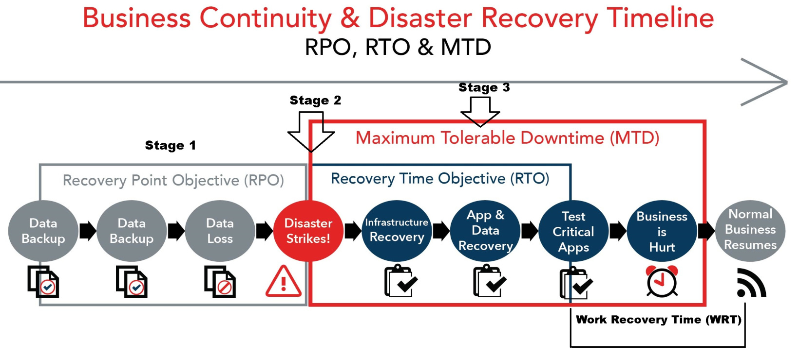

<!-- header: "I143 - Implanter un système de sauvegarde et de restauration" -->
# I143 - Validation et tests

---

# Validation et tests

- Semaine 5

---

# Agenda – Semaine 5

- P_BACKUP
  - Simulation d’une restauration (perte de fichiers, ransomware)
  - Test d’intégrité des sauvegardes
  - Vérification des délais de restauration (RTO / RPO)
- Vérification de la méthode 3-2-1

---

---

## P_Backup – FINIR Partie 4 : 

Installation et configuration de Veeam CE selon la stratégie de backup

---

## P_Backup – COMMENCER Partie 5 : 

- Simulation
- Tests
- Délais RPO / RTO
- Rendre 80% ⚠️
