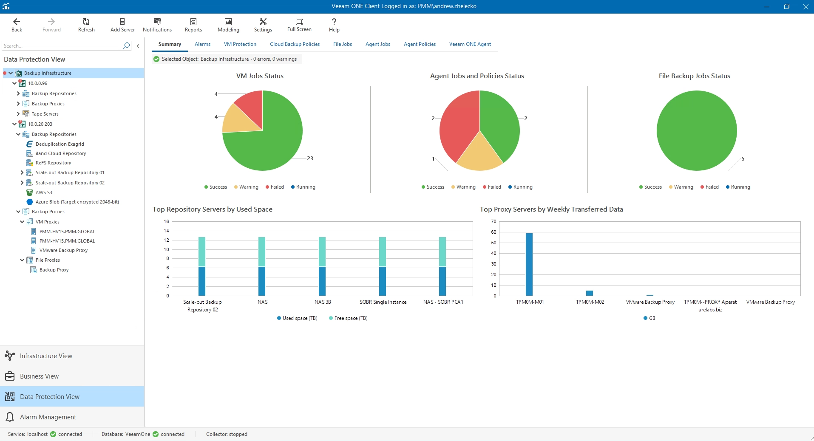
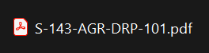

<!-- header: "I143 - Implanter un système de sauvegarde et de restauration" -->
# I143 - Optimisation, DRP et Documentation

---

# Optimisation DRP Documentation

- Semaine 6

---

# Agenda – Semaine 6

- Optimisation & Monitoring
  - Gestion des logs et monitoring.
  - Réduction des fenêtres de sauvegarde.
- Documentation
  - Documentation maintenance et exploitation.
  - Documentation utilisateur (procédures de restauration end-user).
- Rappel DRP
- P_BACKUP : Introduction aux outils d’analyse et de reporting

---

# Optimisation des sauvegardes

- Réduction des fenêtres de sauvegarde :
  - Revoir la stratégie de backup : On sauvegarde quoi ? A quelle fréquence ? Est-ce réellement critique  ?
  - Planification intelligente : Horaires adaptés, sauvegardes incrémentales.
  - Inspection des logs pour trouver les bottleneck : Réseau ? Vitesse d’écriture  ?

---

# Monitoring des sauvegardes

- Surveillance en temps réel : État des jobs de sauvegarde et des restaurations.
- Alertes automatisées : Notification des échecs et dépassements de seuils critiques. (email, push, etc)
- Rapports analytiques : Analyse des tendances et performances (exemple : Veeam Backup Reports ou Veeam One).

---

---

# Documentation maintenance et exploitation

- Objectif : Fournir aux équipes IT les informations nécessaires pour maintenir et exploiter le système de sauvegarde.
- Contenu clé :
  - Instructions pour vérifier l’état des sauvegardes.
  - Étapes pour résoudre les problèmes courants.
  - Étapes pour les actions courantes / demandes courantes.
  - Procédures de mise à jour des outils (ex. Veeam, rClone).
  - Planification et rotation des supports (si applicable).

---

# Documentation utilisateur

- Objectif : Permettre aux utilisateurs finaux d’effectuer des restaurations simples et rapides.
- Contenu clé :
  - Guide pas-à-pas pour restaurer des fichiers perdus ou corrompus. (P.ex ShadowCopy, ou sur le Cloud)
  - Explications adaptées aux utilisateurs non techniques.
  - Exemple : Captures d’écran des interfaces (ShadowCopy, OneDrive, etc)
  - FAQ sur les erreurs fréquentes et solutions.

---

# Qu’est-ce qu’un DRP ?

- Définition :
  - Un plan documenté visant à répondre rapidement et efficacement à un incident majeur, tel qu’une panne matérielle, une cyberattaque ou une catastrophe naturelle.
- Objectifs :
  - Réduire les temps d’arrêt.
  - Assurer la continuité des activités.
  - Protéger les données et les actifs critiques.

---

# Les éléments clés d’un DRP

- Identification des actifs critiques :
  - Systèmes, bases de données, fichiers essentiels.
- Scénarios de risque :
  - Pannes matérielles.
  - Cyberattaques.
  - Catastrophes naturelles.
- Stratégies de récupération :
  - Sauvegardes locales
  - Sauvegardes hors site.
- Priorisation :
  - Ordre de restauration basé sur la criticité.

---

## Validation et Maintenance du DRP - Assurer l’efficacité du DRP

- Planification de tests réguliers :
  - Tester les procédures de restauration.
  - Simuler des incidents pour évaluer la réactivité.
- Mise à jour continue :
  - Adapter le DRP en fonction des évolutions technologiques et organisationnelles.
- Documentation :
  - Maintenir une version claire et accessible du plan pour toutes les parties prenantes.
- Suivi des indicateurs (RTO / RPO / MTD / WRT)

---

---

# DRP

- Voir document :

---

## P_Backup – FINIR Partie 5 : 

- Simulation
- Tests
- Délais RPO / RTO

---

## P_Backup – COMMENCER Partie 6 : 

- Installation de Veeam One CE
- Configuration de Veeam One CE
- Création du DRP (Dans un fichier annexe) 
- Réutilisez vos analyses / HeatMap , etc
