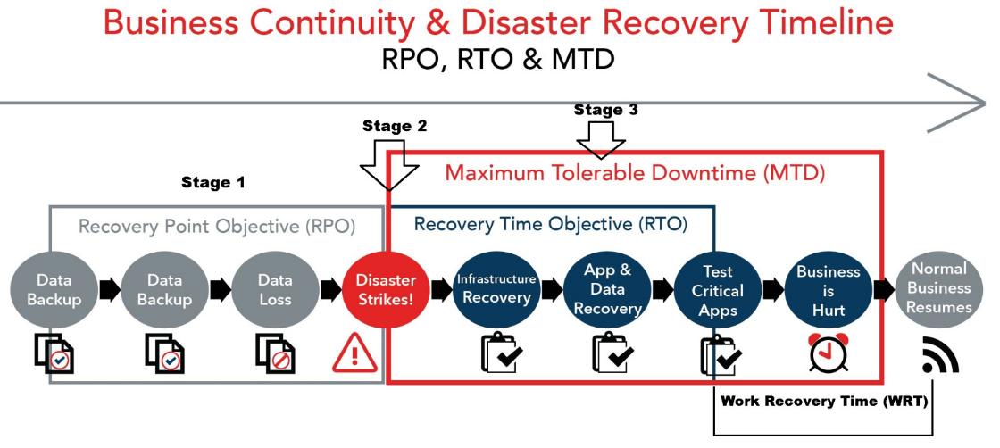

# 📋 S-143-Support-DRP-101 – Introduction au Plan de Reprise Après Sinistre

> Document de support pour le module I143 – Implanter un système de sauvegarde et de restauration

## Introduction au Plan de Reprise Après Sinistre

## Un Plan de Reprise Après Sinistre (Disaster Recovery Plan, DRP) est une approche documentée et complète permettant aux organisations de répondre et de se remettre rapidement des perturbations majeures, y compris les catastrophes naturelles, les cyberattaques et les défaillances des systèmes. Ce document fournit une base essentielle pour créer et maintenir un DRP efficace.

## Objectifs principaux d’un DRP

- **Minimiser les interruptions des opérations normales :**
  - Garantir la continuité des services critiques.

- **Limiter l’étendue des perturbations et des dommages :**
  - Réduire l’impact des incidents sur les opérations.

- **Minimiser l’impact économique :**
  - Réduire les pertes financières en reprenant les opérations rapidement.

- **Établir des moyens alternatifs d’opération à l’avance :**
  - Préparer des solutions temporaires pour maintenir un service minimum.

- **Former le personnel aux procédures d’urgence :**
  - Veiller à ce que tous les acteurs connaissent leur rôle en cas d’incident.

- **Assurer une restauration rapide et fluide des services :**
  - Faciliter le retour à la normale grâce à des protocoles bien définis.
- Création d’un Plan de Reprise Après Sinistre

**Étape 1 : Identifier, évaluer et prioriser les risques**
  - Collaborer avec les décideurs IT et les parties prenantes pour documenter les menaces potentielles.
  - Évaluer la probabilité et l’impact de chaque menace.

**Étape 2 : Aligner les risques avec les opérations critiques**
  - Identifier les fonctions métier essentielles.
  - Définir les objectifs RTO (Recovery Time Objective) et RPO (Recovery Point Objective) pour chaque fonction.

**Étape 3 : Répondre aux risques par la sauvegarde et la récupération**
  - Documenter les pratiques actuelles de sauvegarde et de récupération.
  - Identifier les lacunes ou insuffisances des processus existants.
  - Élaborer des stratégies pour combler ces lacunes.

**Étape 4 : Constituer une équipe de reprise après sinistre**
  - Créer une liste des membres de l’équipe et de leurs rôles respectifs.
  - Attribuer des responsabilités pour chaque scénario et effort de récupération.

**Étape 5 : Tester et évaluer le plan**
  - Planifier des tests réguliers du processus de récupération.
  - Mesurer les performances par rapport aux objectifs et corriger les insuffisances.

**Étape 6 : Partager et affiner le plan**
  - Distribuer le plan aux parties prenantes pour recueillir des commentaires.
  - Mettre à jour le plan après chaque test et incident réel.
- Éléments clés d’un DRP

- **Opérations critiques :**
  - Prioriser les fonctions essentielles et identifier les risques associés.

- **Pratiques actuelles de sauvegarde et de récupération :**
  - Résumer les politiques, processus et technologies existantes.
  - Mettre en évidence les lacunes ou faiblesses connues.

- **Réduction des vulnérabilités :**
- Décrire comment les pratiques actuelles atténuent les risques.
- Proposer des améliorations si nécessaire.

- **Équipe de reprise après sinistre :**
- Lister les membres de l’équipe et leurs responsabilités.

- **Calendrier de tests et de maintenance :**
  - Définir la fréquence et la portée des tests du DRP.
- Préciser comment les résultats guideront les mises à jour.

- **Engagement des parties prenantes :**
- Encourager les retours pour améliorer le plan en continu.
- Scénarios courants de sinistre

- **Catastrophes naturelles :**
- Inondations, tremblements de terre, ouragans.
- Réponse : Relocaliser les systèmes critiques dans des zones non affectées.

- **Incidents de cybersécurité :**
- Ransomware, attaques DDoS, violations de données.
- Réponse : Restaurer les sauvegardes et isoler le réseau.

- **Défaillances matérielles/infrastructurelles :**
- Pannes de serveurs, coupures d’électricité.
- Réponse : Basculer vers des systèmes redondants ou une infrastructure cloud.

- **Erreurs humaines :**
- Suppressions accidentelles, mauvaises configurations.
- Réponse : Implémenter des contrôles de version robustes et des sauvegardes fréquentes.
- RTO, RPO, MTD et WRT : Mesures critiques

- **Recovery Time Objective (RTO) :**
- Temps maximal acceptable pour restaurer les opérations.
- Exemple : Les systèmes de messagerie doivent être opérationnels dans les 2 heures suivant une panne.

- **Recovery Point Objective (RPO) :**
- Perte de données maximale acceptable, mesurée en temps.
- Exemple : Les fichiers récupérés ne doivent pas dater de plus de 15 minutes avant l’incident.

- **Maximum Tolerable Downtime (MTD) :**
- Temps total maximal pendant lequel un processus peut rester indisponible avant de causer des dommages irréversibles à l’organisation.
- Exemple : Une application critique pour les ventes ne peut pas être indisponible plus de 48 heures.

- **Work Recovery Time (WRT) :**
- Temps requis pour restaurer l’état fonctionnel complet après la fin de la récupération technique.
- Exemple : Une fois le serveur restauré, il peut falloir 2 heures supplémentaires pour reconfigurer les systèmes et vérifier leur fonctionnement.

- **Relation entre ces mesures :**
- L’équilibre entre RTO, RPO, MTD et WRT permet de minimiser les interruptions tout en évitant des coûts excessifs. Ces indicateurs travaillent ensemble pour garantir une reprise efficace et rapide.
- Tests et maintenance du DRP

- **Fréquence des tests :**
  - Planifier des simulations trimestrielles et annuelles pour les systèmes clés.

- **Évaluation des performances :**
  - Mesurer le succès en fonction du respect des RTO et RPO.

- **Amélioration continue :**
  - Mettre à jour régulièrement le DRP pour refléter les changements organisationnels et technologiques.
- Conclusion
- Un Plan de Reprise Après Sinistre bien documenté et régulièrement testé est essentiel pour protéger les opérations critiques de l’entreprise et minimiser les interruptions. En alignant les stratégies de récupération sur les priorités métier et en améliorant continuellement le plan, les organisations peuvent assurer leur résilience face à une variété de menaces.